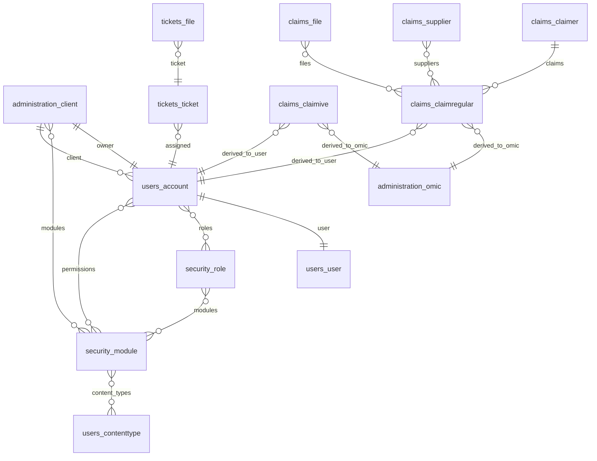

# Data Models

_Auto-generated on 2025-06-26 16:34 UTC_

## Table of Contents
- [Common](#common)
  - [BaseModel](#basemodel)
- [Administration](#administration)
  - [Client](#client)
  - [TrafficLightSystemTimes](#trafficlightsystemtimes)
  - [Omic](#omic)
  - [StandardsAndProtocols](#standardsandprotocols)
- [Claims](#claims)
  - [Supplier](#supplier)
  - [Claimer](#claimer)
  - [File](#file)
  - [ClaimRegular](#claimregular)
  - [ClaimIVE](#claimive)
- [Security](#security)
  - [Module](#module)
  - [Role](#role)
- [Tickets](#tickets)
  - [TicketFile](#ticketfile)
  - [Ticket](#ticket)
- [Gdeba](#gdeba)
- [Users](#users)
  - [ContentType](#contenttype)
  - [User](#user)
  - [Account](#account)
- [Reports](#reports)
- [Entity Relationship Diagram](#entity-relationship-diagram)

## Common

### BaseModel
Defined in [common/models.py](../common/models.py).

Modelo base abstracto que centraliza campos de auditoría y utilidades
compartidas por el resto de los modelos del sistema.

_No class docstring available._

| Field | Type | Null | Blank | Default | Unique | Related Name |
|-------|------|------|-------|---------|--------|--------------|
| uuid | UUIDField | False | False | `uuid4()` | PK | |
| created_at | DateTimeField | True | True |  |  | |
| created_by | ForeignKey to `users.User` | True |  |  |  | `created_%(app_label)s_%(class)s` |
| created_from | CharField(50) | True | True | '' |  | |
| modified_at | DateTimeField | True | True |  |  | |
| modified_by | ForeignKey to `users.User` | True |  |  |  | `modified_%(app_label)s_%(class)s` |
| modified_from | CharField(50) | True | True | '' |  | |

Custom manager: `objects = models.Manager.from_queryset(BaseQuerySet)()`.

## Administration

### Client
Defined in [administration/models.py](../administration/models.py).

Representa a la organización que utiliza el sistema y almacena su
información de contacto, módulos habilitados y configuraciones
administrativas.

_No class docstring available._

| Field | Type | Null | Blank | Default | Unique | Related Name |
|-------|------|------|-------|---------|--------|--------------|
| name | CharField(255) | False | False |  | True | |
| logo | ImageField | True | True |  |  | |
| phone | PhoneNumberField | False | True |  |  | |
| address | TextField | False | True | '' |  | |
| owner | OneToOneField to `users.Account` | True |  |  |  | `client_owner` |
| modules | ManyToManyField to `security.Module` |  | True |  |  | |
| cant_students | IntegerField | False | True | 0 |  | |
| is_deleted | BooleanField | False | False | False |  | |

### TrafficLightSystemTimes
Defined in [administration/models.py](../administration/models.py).

Guarda la configuración de tiempos límite para el sistema de semáforos,
determinando cuándo un reclamo pasa de verde a amarillo y de amarillo a
rojo.

| Field | Type | Null | Blank | Default | Unique | Related Name |
|-------|------|------|-------|---------|--------|--------------|
| greenToYellow_c | IntegerField | False | True | 0 |  | |
| yellowToRed_c | IntegerField | False | True | 0 |  | |
| greenToYellow_ive_hv | IntegerField | False | True | 0 |  | |
| yellowToRed_ive_hv | IntegerField | False | True | 0 |  | |

### Omic
Defined in [administration/models.py](../administration/models.py).

Registra las distintas oficinas OMIC y su información de contacto,
incluyendo responsables, horarios de atención y medios de comunicación.

| Field | Type | Null | Blank | Default | Unique | Related Name |
|-------|------|------|-------|---------|--------|--------------|
| name | CharField(255) | False | False |  |  | |
| responsible | CharField(255) | False | False |  |  | |
| opening_hours | CharField(255) | False | True |  |  | |
| phone | CharField(255) | True | True |  |  | |
| address | CharField(255) | True | True |  |  | |
| email | CharField(255) | False | False |  |  | |

### StandardsAndProtocols
Defined in [administration/models.py](../administration/models.py).

Modelo utilizado para almacenar documentos, normas y protocolos que se
comparten dentro de la plataforma.

| Field | Type | Null | Blank | Default | Unique | Related Name |
|-------|------|------|-------|---------|--------|--------------|
| title | CharField(255) | False | False |  |  | |
| description | CharField(300) | False | False |  |  | |
| file | FileField | False | False |  |  | |

## Claims

### Supplier
Defined in [claims/models.py](../claims/models.py).

Almacena información de proveedores o comercios involucrados en un
reclamo, tales como nombre y datos de contacto.

| Field | Type | Null | Blank | Default | Unique | Related Name |
|-------|------|------|-------|---------|--------|--------------|
| fullname | CharField(255) | False | False |  |  | |
| cuil | CharField(50) | False | False |  |  | |
| address | CharField(255) | False | False |  |  | |
| num_address | CharField(10) | False | True |  |  | |
| city | CharField(255) | False | False |  |  | |
| zip_code | CharField(10) | False | False |  |  | |

### Claimer
Defined in [claims/models.py](../claims/models.py).

Representa a la persona que realiza el reclamo y guarda sus datos
personales, de contacto y domicilio.

| Field | Type | Null | Blank | Default | Unique | Related Name |
|-------|------|------|-------|---------|--------|--------------|
| fullname | CharField(255) | False | False |  |  | |
| dni | CharField(15) | False | False |  |  | |
| cuit | CharField(20) | False | False |  |  | |
| email | EmailField | False | False |  |  | |
| gender | CharField(10) | False | False |  | choices | |
| street | CharField(120) | False | True | '' |  | |
| number | CharField(15) | False | True | '' |  | |
| between_streets | CharField(15) | False | True | '' |  | |
| province | CharField(120) | False | True | '' |  | |
| city | CharField(120) | False | True | '' |  | |

### File
Defined in [claims/models.py](../claims/models.py) (claim attachments).

Permite asociar archivos y documentos a un reclamo para complementar la
información presentada.

| Field | Type | Null | Blank | Default | Unique | Related Name |
|-------|------|------|-------|---------|--------|--------------|
| file | FileField | False | False |  |  | |
| file_name | CharField(255) | False | False |  |  | |
| claim | TextField(255) | True | True |  |  | |

### ClaimRegular
Defined in [claims/models.py](../claims/models.py).

Modelo central para registrar reclamos generales. Relaciona al reclamante
con los proveedores y permite llevar el seguimiento y estado del trámite.

| Field | Type | Null | Blank | Default | Unique | Related Name |
|-------|------|------|-------|---------|--------|--------------|
| id | CharField(255) | False | False |  | True | |
| claimer | ForeignKey to `Claimer` | False |  |  |  | `claims` |
| suppliers | ManyToManyField to `Supplier` |  |  |  |  | |
| problem_description | TextField | False | True |  |  | |
| activity | JSONField | True | True | [] |  | |
| files | ManyToManyField to `File` |  |  |  |  | |
| claim_access | CharField(255) | True | True |  |  | |
| type_of_claim | CharField(255) | True | True | "S/A" |  | |
| claim_status | CharField(255) | True | True | "En análisis" |  | |
| category | CharField(255) | True | True |  |  | |
| heading | CharField(255) | True | True |  |  | |
| subheading | CharField(255) | True | True |  |  | |
| transfer_to_company | CharField(255) | True | True |  |  | |
| derived_to_omic | ForeignKey to `Omic` | True |  |  |  | `derived_omic` |
| derived_to_user | ForeignKey to `users.Account` | True |  |  |  | `account` |
| transfer_to_the_consumer | CharField(255) | True | True |  |  | |
| conciliation_hearing | CharField(255) | True | True |  |  | |
| imputation | CharField(255) | True | True |  |  | |
| resolution | CharField(255) | True | True |  |  | |
| monetary_agreement | CharField(255) | True | True |  |  | |

Methods include `get_year_letter`, `get_last_claim_number`, custom `save`, and notification helpers.

### ClaimIVE
Defined in [claims/models.py](../claims/models.py).

Versión especializada del modelo de reclamos para casos de IVE/HV. Incluye
datos personales y los motivos del reclamo asociados a la atención de la
salud reproductiva.

| Field | Type | Null | Blank | Default | Unique | Related Name |
|-------|------|------|-------|---------|--------|--------------|
| id | CharField(255) | False | False |  | True | |
| fullname | CharField(255) | False | False |  |  | |
| dni | CharField(255) | False | False |  |  | |
| birthdate | DateField | True | False |  |  | |
| email | CharField(255) | False | False |  |  | |
| phone | CharField(255) | False | False |  |  | |
| street | CharField(120) | False | True | '' |  | |
| number | CharField(15) | False | True | '' |  | |
| between_streets | CharField(15) | False | True | '' |  | |
| province | CharField(120) | False | True | '' |  | |
| city | CharField(120) | False | True | '' |  | |
| has_social_work | BooleanField | False | False | False |  | |
| social_work_or_company | CharField(255) | False | False |  |  | |
| establishment | CharField(255) | False | True |  |  | |
| other | CharField(255) | False | True |  |  | |
| reasons | MultiSelectField | False | False |  | choices | |
| activity | JSONField | True | True | [] |  | |
| claim_access | CharField(255) | True | True |  |  | |
| type_of_claim | CharField(255) | True | True | "IVE" |  | |
| claim_status | CharField(255) | True | True | "En análisis" |  | |
| category | CharField(255) | True | True |  |  | |
| heading | CharField(255) | True | True |  |  | |
| subheading | CharField(255) | True | True |  |  | |
| transfer_to_company | CharField(255) | True | True |  |  | |
| derived_to_omic | ForeignKey to `Omic` | True |  |  |  | `derived_omic_ive` |
| derived_to_user | ForeignKey to `users.Account` | True |  |  |  | `account_ive` |
| transfer_to_the_consumer | CharField(255) | True | True |  |  | |
| conciliation_hearing | CharField(255) | True | True |  |  | |
| imputation | CharField(255) | True | True |  |  | |
| resolution | CharField(255) | True | True |  |  | |
| monetary_agreement | CharField(255) | True | True |  |  | |

Methods similar to `ClaimRegular` with ID generation and notifications.

## Security

### Module
Defined in [security/models.py](../security/models.py).

Representa funcionalidades o módulos del sistema que pueden asociarse a
roles y permisos para controlar el acceso a los distintos contenidos.

| Field | Type | Null | Blank | Default | Unique | Related Name |
|-------|------|------|-------|---------|--------|--------------|
| parents | ManyToManyField to self |  | True |  |  | `children` |
| name | CharField(255) | False | False |  | True | |
| mapping_key | CaseInsensitiveCharField(50) | False | False |  | True | |
| content_types | ManyToManyField to `users.ContentType` |  |  |  |  | `modules` |

Custom methods: `validate`, `clean`, `save`.

### Role
Defined in [security/models.py](../security/models.py).

Agrupa un conjunto de módulos para establecer diferentes niveles de
permisos que pueden asignarse a las cuentas de usuario.

| Field | Type | Null | Blank | Default | Unique | Related Name |
|-------|------|------|-------|---------|--------|--------------|
| name | CharField(255) | False | False |  |  | |
| description | TextField | False | True | '' |  | |
| modules | ManyToManyField to `Module` |  |  |  |  | |

## Tickets

### TicketFile
Defined in [tickets/models.py](../tickets/models.py).

Permite adjuntar documentos e imágenes a un ticket de soporte para
registrar evidencias o información adicional.

| Field | Type | Null | Blank | Default | Unique | Related Name |
|-------|------|------|-------|---------|--------|--------------|
| file | FileField | False | False |  |  | |
| file_name | CharField(255) | False | False |  |  | |
| ticket | ForeignKey to `Ticket` | False |  |  |  | `files` |

### Ticket
Defined in [tickets/models.py](../tickets/models.py).

Registra solicitudes o incidencias de soporte vinculadas a reclamos y
permite seguir su estado, asignación y tareas asociadas.

| Field | Type | Null | Blank | Default | Unique | Related Name |
|-------|------|------|-------|---------|--------|--------------|
| id | CharField(255) | False | False |  | True | |
| claim | CharField(255) | True | True |  |  | |
| assigned | ForeignKey to `users.Account` | True |  |  |  | `assigned` |
| status | CharField(30) | False | True | "pending_review" |  | |
| support_level | CharField(30) | False | True | "unassigned" |  | |
| activity | JSONField | True | True | [] |  | |
| problem_description | TextField | False | True |  |  | |
| tasks | JSONField | True | True | [] |  | |

## Gdeba

Esta app no define modelos concretos; su lógica se orienta a la generación de documentos mediante los servicios de GEDO BA.

## Users

### ContentType
Defined in [users/models.py](../users/models.py) as a proxy model for Django's `ContentType`.

Se usa para hacer referencia a los distintos modelos de la aplicación
mediante el sistema estándar de `ContentType` de Django.

### User
Defined in [users/models.py](../users/models.py).

Usuario del sistema encargado de la autenticación. Incluye datos básicos,
estado y utilidades para la gestión de accesos.

| Field | Type | Null | Blank | Default | Unique | Related Name |
|-------|------|------|-------|---------|--------|--------------|
| display_name | CaseInsensitiveCharField(150) | False | False | '' | True | |
| email | EmailField(255) | False | False |  | True | |
| is_active | BooleanField | False | False | True |  | |
| is_staff | BooleanField | False | False | False |  | |
| last_access | DateTimeField | True | True |  |  | |
| last_login | DateTimeField | True | True |  |  | |
| reset_password_token | CharField(100) | False | True | '' |  | |
| reset_password_token_exp | DateTimeField | True | True |  |  | |

Manager: `UserManager` with custom creation methods.

### Account
Defined in [users/models.py](../users/models.py).

Extiende al usuario con información adicional como roles, cliente al que
pertenece y permisos específicos dentro del sistema.

| Field | Type | Null | Blank | Default | Unique | Related Name |
|-------|------|------|-------|---------|--------|--------------|
| id | IntegerField | False | False |  | True | |
| user | OneToOneField to `User` | False |  |  |  | |
| full_name | CharField(70) | False | True | '' |  | |
| phone | CharField(15) | False | True | '' |  | |
| profile_image | ImageField | True | True |  |  | |
| dni | CharField(15) | False | True | '' |  | |
| comments | TextField(255) | False | True | '' |  | |
| omic | ForeignKey to `administration.Omic` | True |  |  |  | |
| support_level | CharField(125) | False | True | '' |  | |
| client | ForeignKey to `administration.Client` | True |  |  |  | `accounts` |
| roles | ManyToManyField to `security.Role` |  |  |  |  | `accounts` |
| last_login | DateTimeField | True | True |  |  | |
| is_active | BooleanField | False | False | True |  | |
| is_admin | BooleanField | False | False | False |  | |
| is_online | BooleanField | False | False | False |  | |
| permissions | ManyToManyField to `security.Module` |  |  |  |  | `accounts` |
| is_deleted | BooleanField | False | False | False |  | |

Additional methods handle ID generation and file path helpers.

## Reports
This app defines no concrete models.

## Entity Relationship Diagram

