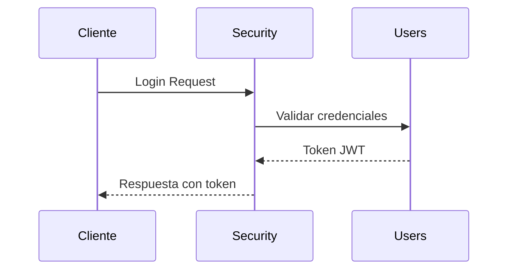
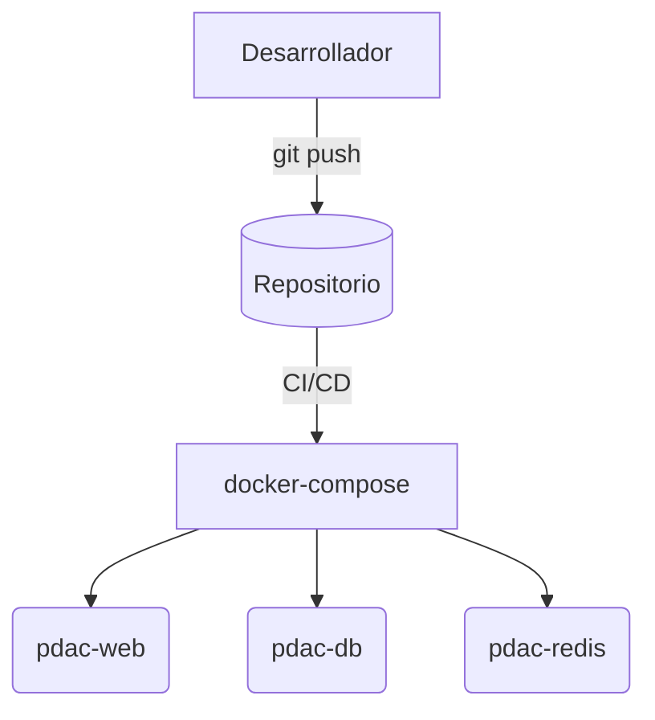

# Documentación del Sistema PDAC

## Descripción General

PDAC es un backend modular en Django que centraliza la gestión de tickets y reclamos. Su diseño enfatiza la seguridad, el rendimiento y la extensibilidad.

## Tabla de contenidos
1. [Estructura del Sistema](#estructura-del-sistema)
2. [Arquitectura Base](#arquitectura-base)
3. [Flujo de Datos](#flujo-de-datos)
4. [Configuración y Despliegue](#configuración-y-despliegue)
5. [Componentes Comunes](#componentes-comunes)
6. [Tareas en Segundo Plano](#tareas-en-segundo-plano)
7. [Mejores Prácticas](#mejores-prácticas)
8. [Extensibilidad](#extensibilidad)
9. [Mantenimiento](#mantenimiento)
10. [Recursos Adicionales](#recursos-adicionales)

## Estructura del Sistema

```
backend/
├── administration/    # Administración y parámetros globales
├── claims/           # Reclamos y seguimiento
├── common/           # Bases reutilizables
├── docker/           # Imágenes y scripts
├── security/         # Autenticación y permisos
├── settings/         # Configuración principal
├── gdeba/            # Integración con GEDO BA
├── tickets/          # Gestión de tickets
└── users/            # Perfiles y cuentas
```

### gdeba/
Aplicación para integrarse con el sistema GEDO BA y generar documentos
electronicos a partir de los reclamos. Sus rutas están en
[`gdeba/api/v1/urls.py`](../gdeba/api/v1/urls.py) y las vistas en
[`gdeba/api/v1/views.py`](../gdeba/api/v1/views.py).

## Arquitectura Base

La mayoría de las apps heredan de **BaseModel** y exponen sus APIs mediante **BaseView**. Consulta las guías específicas para los detalles de implementación:
- [BaseModel](./base-model.md)
- [BaseView](./base-view.md)
- Ejemplos completos en [administration-api-v1.md](./administration-api-v1.md) y documentos similares.

## Flujo de Datos

### Autenticación y Autorización


### Operaciones CRUD
Las vistas derivadas de `BaseView` procesan peticiones REST tradicionales (GET, POST, PATCH, DELETE) y devuelven respuestas JSON con permisos calculados.

## Configuración y Despliegue

Las instrucciones completas para levantar el proyecto están en [Project Root Overview](./project-root-overview.md). Revisa especialmente la sección sobre [`docker-compose.yml`](./project-root-overview.md#2-docker-composeyml).

### Variables de Entorno
El archivo `.env.template` lista todas las opciones configurables. Algunas variables clave son `DB_NAME`, `JWT_SECRET` y `REDIS_ENABLED`.

### Deployment Diagram


## Componentes Comunes

| Carpeta/Archivo | Propósito |
|-----------------|-----------|
| `common/` | Utilidades, vistas y modelos base |
| `settings/` | Configuración Django y ajustes de entorno |
| `docker/` | Dockerfile y scripts de arranque |
| `media/` | Archivos cargados por los usuarios |

## Tareas en Segundo Plano

Las tareas programadas se definen en [`settings/celery.py`](../settings/celery.py) y se ejecutan con Celery utilizando Redis como broker. Para la gestión de autenticación y caché consulta [`settings/middlewares.py`](../settings/middlewares.py) y [`settings/cache.py`](../settings/cache.py).

## Mejores Prácticas
- Usar los modelos base para mantener auditoría y permisos.
- Prefetch y select-related para consultas eficientes.
- Documentar cada nueva API en su archivo correspondiente.

## Extensibilidad
- Agrega nuevos módulos creando apps que hereden de BaseModel y expongan vistas de BaseView.
- Sobrescribe métodos como `get_permissions` o combina mixins para personalizaciones avanzadas.

## Mantenimiento
- Los logs se almacenan en `log/debug.log` y rotan automáticamente.
- Las copias de seguridad de la base y la carpeta `media` se gestionan vía Docker.
- Health checks y métricas básicas están disponibles para monitoreo continuo.

## Recursos Adicionales
- [Django](https://docs.djangoproject.com/)
- [Django REST Framework](https://www.django-rest-framework.org/)
- [Celery](https://docs.celeryq.dev/)
